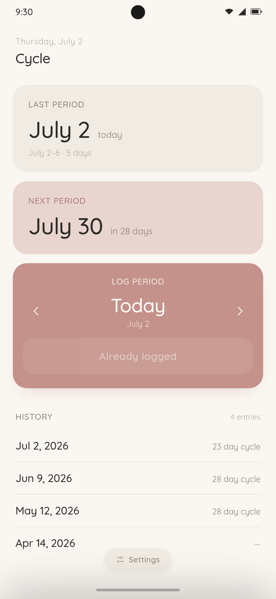
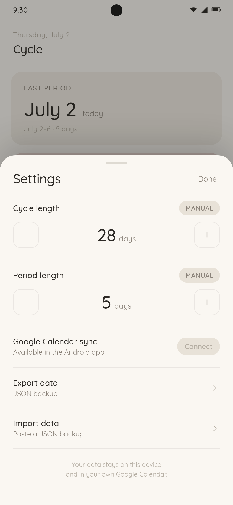
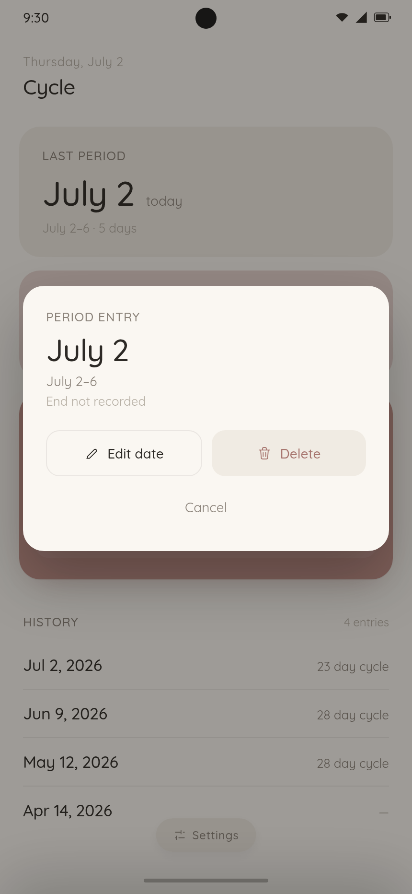

# Cycle

Cycle is a minimalist period tracking app built with React, Vite, and Capacitor for Android.

The app is local-first: period history is stored on the device, backups are JSON, and the optional Google Calendar sync writes only to the user's own **Period Tracker** calendar.

## Screenshots

<p>
  
  
  
</p>

## What Works Now

- Log a period start for today, yesterday, tomorrow, or up to 7 days in either direction.
- See the last logged period, the predicted next period, late-state messaging, and a reverse-chronological history list.
- Edit an entry's start date, set or clear its end date, and delete entries.
- Configure cycle length and period length manually, or switch either to automatic mode.
- Auto cycle length uses the median of recent start-to-start gaps.
- Auto period length uses the median of the last five entries with recorded end dates.
- Persist data in browser storage / Android WebView storage using schema v2 while still migrating older plain-date entries.
- Export a schema v2 JSON backup. On Android this opens the share sheet; on web it copies to the clipboard when available and otherwise downloads `cycle-backup.json`.
- Import a JSON backup by pasting it into the app. Imports merge by start date, fill missing end dates and event ids, and do not delete existing local entries.
- Optional Android-only Google Calendar sync:
  - OAuth PKCE sign-in via the system browser.
  - Token storage through Capacitor Preferences.
  - Calendar lookup/creation for `Period Tracker`.
  - Pulls real past all-day `period start` / `period end` events through tomorrow and ignores future projection events.
  - Pushes local creates, updates, and deletes back to Google Calendar.
  - Tracks event ids, tombstones, last sync time, reconnect-needed state, and a manual "Sync now" action.

## Project Shape

- `src/CycleApp.jsx` - main app UI, local storage schema, import/export, history editing, and sync UI wiring.
- `src/main.jsx` - React entry point plus Capacitor status bar and splash screen setup.
- `src/sync.js` - pure Google Calendar sync planner.
- `src/run-sync.js` - sync orchestration that connects auth, Calendar API calls, and the planner.
- `src/gcal.js` - thin Google Calendar REST client.
- `src/auth.js` - Android OAuth PKCE flow and token refresh.
- `src/sync-config.example.js` - template for the gitignored `src/sync-config.js`.
- `period-import.json` - local, gitignored seed export with private period history.
- `docs/superpowers/specs/2026-07-02-google-calendar-sync-design.md` - sync design notes.
- `docs/superpowers/plans/2026-07-02-google-calendar-sync.md` - implementation plan and remaining checklist.

## Development

```bash
npm install
npm run dev
```

Run tests:

```bash
npm test
```

Build the web app:

```bash
npm run build
```

## Android

Install a JDK and Android Studio / Android SDK, then build and sync the Capacitor project:

```bash
npm run cap:sync
```

Build a debug APK:

```bash
cd android
ANDROID_HOME=$HOME/Android/Sdk ./gradlew assembleDebug --no-daemon
```

The debug APK is generated under `android/app/build/outputs/apk/debug/`.

## Google Calendar Sync Setup

Sync is implemented but requires a local Google OAuth client configuration that is intentionally not committed.

1. Copy `src/sync-config.example.js` to `src/sync-config.js`.
2. Create an Android OAuth client in Google Cloud for package `com.jade.cycle`.
3. Set `SYNC_CONFIG.clientId` in `src/sync-config.js`.
4. Set `OAUTH_SCHEME` in `android/gradle.properties` to `com.googleusercontent.apps.<client-id-without-.apps.googleusercontent.com>`.
5. Rebuild and install the Android app.

The detailed setup doc is still part of the remaining plan; for now the working notes live in `docs/superpowers/plans/2026-07-02-google-calendar-sync.md`.

## Plan Status

Implemented:

- Schema v2 entries with migration from the old date-array model.
- Per-entry end dates and period-length auto mode based on actual recorded ends.
- JSON export/import with merge semantics.
- Pure sync planner with tests for pairing, projection filtering, creates, updates, deletes, tombstones, and id/date matching.
- Google Calendar REST client.
- OAuth PKCE auth flow.
- Sync orchestration and Settings UI for connect, sync now, sign out, and status messaging.

Still left:

- Runtime browser verification for migration parity, end-date bounds, import/export, and web sync-disabled state.
- Runtime Android verification before credentials: Connect should open the Google error page with the placeholder client id and return without crashing.
- Write `docs/google-cloud-setup.md` from the plan's setup notes.
- Complete live verification on Jade's phone with real credentials:
  - import the seed backup and confirm 40 entries;
  - connect Google Calendar and verify first sync links existing events without duplicating them;
  - create, end, move, and delete a test entry across app and calendar;
  - relaunch and confirm data and auth persistence.
- After first successful sync, end the old recurring `period start` and `period end` series in Google Calendar so future projection events stop accumulating.
